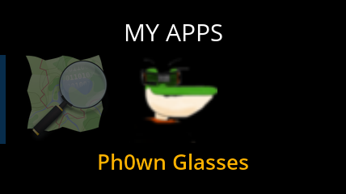
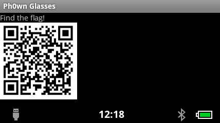

# Ph0wn CTF: Help X-Men Stage 1

**Category**: Misc, **Points**: 50, **Solves**: 7

## Description

Alert! Somebody stole Scotty's (aka Cyclops) glasses!
You know, Scotty's glasses help him control the beam of energy that come out of his eyes.

Those glasses have been replaced by [Recon Jet](https://www.reconinstruments.com/products/jet/) smart glasses. They look cool, but they have something strange. And they're not the right ones for Scotty.

Can you please help Scotty?

### Rules for this challenge

- Come and ask for a time slot to get the smart glasses.
- **Please handle the glasses with care** we intend to use them after the CTF!
- **You are NOT authorized to leave the room with the glasses**.
- This is not a hardware challenge, but an IoT challenge ;) You **are not authorized to physically hack the hardware**,(and you won't need to).
- You are **NOT allowed to do a factory reset** on the glasses. **If we see you did so, we will remove 20 points from your team's score**. However, don't worry, a factory reset is intentional, you won't do one accidentally.
- As much as possible, please keep the glasses **charged** for your team, and for other teams. Be fair.

## Write-up

First, participants should try the glasses on and notice that there is an app named `Ph0wn glasses` in My apps.




When they launch the app, they will see a QR code. They need to read that QR code. It is not difficult in theory, but what's going to be slightly difficult is to retrieve image.

There are three solutions I foresee:

1. People take a screenshot using adb
2. People get the app and retrieve the image from the app
3. People take a picture of what they see in the glasses somehow (difficult!)

### Solution 1: Screenshot on the glasses

When the QR code is displayed, connect to the glasses via adb

Connect to the glasses:

```bash
$ adb devices
List of devices attached 
291052171	device

$ adb shell screencap -p /sdcard/stage1.png
$ adb pull /sdcard/stage1.png .
```

### Solution 2: Retrieving the application

```bash
$ adb shell
$ pm list packages -f
...
package:/data/app/ph0wn.reconjet-1.apk=ph0wn.reconjet
```

Retrieve the application:
```bash
$ adb pull /data/app/ph0wn.reconjet-1.apk .
469 KB/s (47185 bytes in 0.098s)
```

Unzip the application and find the PNG in the assets:

```bash
$ unzip ph0wn.reconjet-1.apk -d ph0wn
Archive:  ph0wn.reconjet-1.apk
  inflating: ph0wn/AndroidManifest.xml  
 extracting: ph0wn/assets/qrcode.png  
...
```

### Scanning the QR code

Scan this QR code, and you will see the message `The flag is: Ph0wn{ScottWishesHeHadOurSmartGlasses} Stage 2 key: X@M`


### Flag

So, we can flag stage 1 with `Ph0wn{ScottWishesHeHadOurSmartGlasses}`


## Other write-ups and resources

- [Duykham stage 1 write-up](https://duykham.blogspot.fr/2017/12/helpxman-stage-1-when-wearing-smart.html)
- [Ph0wn: the 1st CTF of Smart Devices is Over!](https://blog.fortinet.com/2017/12/07/ph0wn-the-1st-ctf-of-smart-devices-is-over)
- [Online QR code generated I used](http://fr.qr-code-generator.com/)
