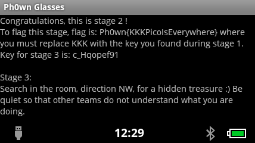

# Ph0wn CTF: Help X-Men Stage 2

**Category**: Misc, **Points**: 100, **Solves**: 2

## Description

There's something (else) to find in the application you noticed during stage 1.

This stage cannot be flagged without stage 1. Or if you manage to, well done, you deserve the points ;P


## Write-up

There is more to find in the Android application. 
If participants haven't done so yet (see [solution 2 of stage 1](../helpxmen-stage1-50/README.md) retrieving the app), they will now need to do so.

The [application is here](./ph0wn.apk) with sha256 hash: `551062235ab35e27e373b184464e97c804e02de8283d4b1d0d15b28434c0d555`

Then, a basic run of `apktool` reveals there is a hidden activity:

```bash
$ java -jar ~/softs/apktool_2.3.0.jar d ph0wn.reconjet-1.apk 
I: Using Apktool 2.3.0 on ph0wn.reconjet-1.apk
I: Loading resource table...
I: Decoding AndroidManifest.xml with resources...
S: WARNING: Could not write to (/home/axelle/.local/share/apktool/framework), using /tmp instead...
S: Please be aware this is a volatile directory and frameworks could go missing, please utilize --frame-path if the default storage directory is unavailable
I: Loading resource table from file: /tmp/1.apk
I: Regular manifest package...
I: Decoding file-resources...
I: Decoding values */* XMLs...
I: Baksmaling classes.dex...
I: Copying assets and libs...
I: Copying unknown files...
I: Copying original files...
```

Show **AndroidManifest.xml**. There is a hidden activity, called `HiddenActivity`.

```xml
<?xml version="1.0" encoding="utf-8" standalone="no"?><manifest xmlns:android="http://schemas.android.com/apk/res/android" package="ph0wn.reconjet" platformBuildVersionCode="16" platformBuildVersionName="4.1.2-1425332">
    <application android:debuggable="true" android:icon="@drawable/ic_launcher" android:label="@string/app_name">
        <activity android:label="@string/app_name" android:name="MainActivity">
            <intent-filter>
                <action android:name="android.intent.action.MAIN"/>
                <category android:name="android.intent.category.LAUNCHER"/>
            </intent-filter>
        </activity>
        <activity android:exported="true" android:name="HiddenActivity"/>
    </application>
</manifest>
```

From this point, there are 2 different solutions to solve the challenge:

1. Display the hidden activity and read what it says. To my opinion, this is the *simplest*.
2. Reverse engineer the Android application.

### Solution 1: Viewing and scrolling the activity

We can display it on the smart glasses with the command:

```
$ adb shell am start -n ph0wn.reconjet/.HiddenActivity
Starting: Intent { cmp=ph0wn.reconjet/.HiddenActivity }
```



The screen is *scrollable*.
The text says the flag's format is `Ph0wn{KKKPicoIsEverywhere}` where KKK is the key we found at stage 1: `X@M`

**So, the flag is: `Ph0wn{X@MPicoIsEverywhere}`**

### Solution 2: Disassembling the application

For example, use `unzip`, `baksmali` and then [procyon decompiler](https://bitbucket.org/mstrobel/procyon/wiki/Java%20Decompiler) to get Java sources of the hidden activity.

```
$ unzip ph0wn.reconjet-1.apk -d
$ ~/softs/dex2jar-0.0.9.16-SNAPSHOT/dex2jar.sh classes.dex
$ java -jar ~/softs/procyon-decompiler-0.5.30.jar --output-directory procyon classes_dex2jar.jar
```

We get this:

```java
// 
// Decompiled by Procyon v0.5.30
// 

package ph0wn.reconjet;

import android.text.method.MovementMethod;
import android.text.method.ScrollingMovementMethod;
import android.os.Bundle;
import android.widget.TextView;
import android.app.Activity;

public class HiddenActivity extends Activity
{
    public TextView txtView;
    
    public HiddenActivity() {
        this.txtView = null;
    }
    
    public void onCreate(final Bundle bundle) {
        super.onCreate(bundle);
        this.setContentView(2130903040);
        (this.txtView = (TextView)this.findViewById(2131034112)).setMovementMethod((MovementMethod)new ScrollingMovementMethod());
        final int[] array = { 67, 111, 110, 103... };
        final StringBuffer sb = new StringBuffer();
        for (int i = 0; i < array.length; ++i) {
            sb.append((char)array[i]);
        }
        this.txtView.setText((CharSequence)sb.toString());
    }
}
```

Let's modify it a bit to run it standalone.

```java
// 
// Decompiled by Procyon v0.5.30
// 

public class StandaloneHiddenActivity
{
    public static void main(String args[]) {
        final int[] array = { 67, 111, 110, 103, .. }; // fill in rest here
        final StringBuffer sb = new StringBuffer();
        for (int i = 0; i < array.length; ++i) {
            sb.append((char)array[i]);
        }
        System.out.println(sb.toString());
    }
}
```

Then compile and run:

```bash
$ javac StandaloneHiddenActivity.java
$ java StandaloneHiddenActivity
Congratulations, this is stage 2 !
To flag this stage, flag is: Ph0wn{KKKPicoIsEverywhere} where you must replace KKK with the key you found during stage 1.
Key for stage 3 is: c_Hqopef91
```

**So, the flag is: `Ph0wn{X@MPicoIsEverywhere}`**.
And we keep in mind `c_Hqopef91` for the next stage.

## Behind the scenes

The tag `android:exported="true"` is important for the activity to be displayable via `adb shell am start`.

I wanted the text to be *scrollable* so that people could solve the challenge without having to reverse the application.
This is done by `txtView.setMovementMethod(new ScrollingMovementMethod());` in the activity and adding maxLines and scrollbars to the layout of hidden:

```xml
<TextView
  android:layout_width="fill_parent" 
    android:layout_height="wrap_content" 
    android:id="@+id/txtView"
    android:maxLines = "9"
    android:scrollbars = "vertical"
    />
```

I didn't want people to find the text with a simple `strings` command on `classes.dex`. So, I passed the int (ASCII) value of each character. I wrote a quick Python script to do that:

```python
# to encode
text='the text to encode'
tab = [ ord(text[i]) for i in range(0, len(text)) ]
print tab

# to decode
decode = [ chr(x) for x in tab ]
print ''.join(decode)
```

## Other write-ups and resources

- [Duykham stage 2 and 3 write-up](https://duykham.blogspot.fr/2017/12/ctfwriteupph0wn-mischelpxman-stage-2.html)
- [Ph0wn: the 1st CTF of Smart Devices is Over!](https://blog.fortinet.com/2017/12/07/ph0wn-the-1st-ctf-of-smart-devices-is-over)

