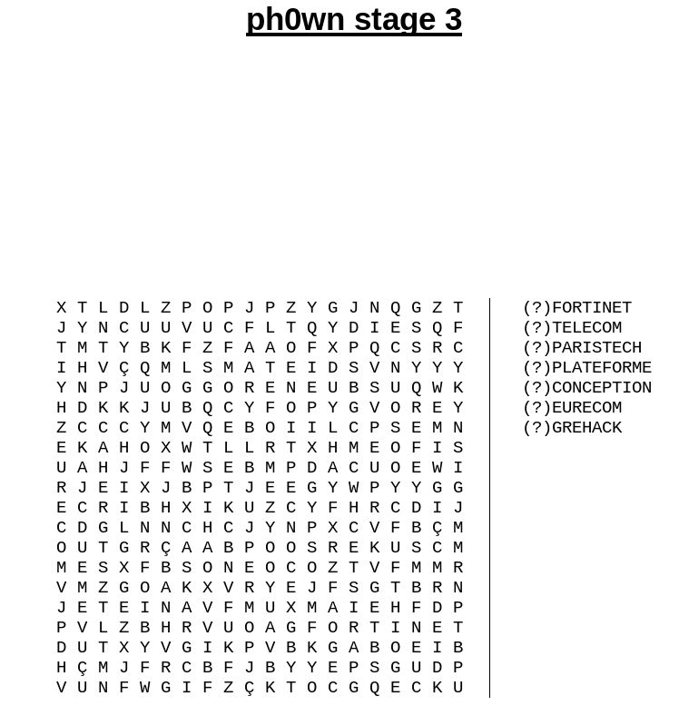
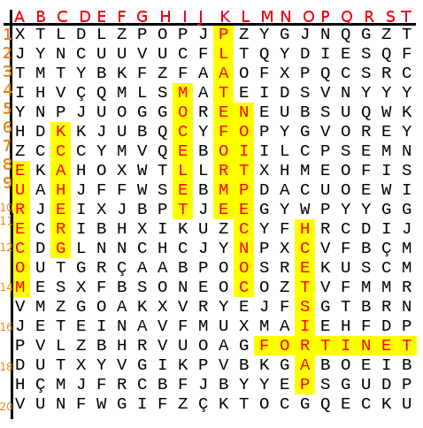

# Ph0wn CTF: Help X-Men Stage 3

**Category**: Misc, **Points**: 100, **Solves**: 2

## Description

You know all you need to know to complete stage 3.

**Errata 1**: if row >= 10, you will have 4 letters to encode the coordinates, not 3. For example G17V means column G, row 17 and vertical.

**Errata 2**: at some point, instead of "KKKKKKKKKK is the key you found during stage 1", you must read "KKKKKKKKKK is the key you found during stage 2".

## Write-up

*This stage doesn't really involve computer skills - apart from using the compass on the smart glasses. 100 points for this was quite generous, but meant to reward people for doing all 3 stages of the Help X-Men family.*

Use **ReconJet**'s compass (or any other compass you might have) to head North West.
You will find mixed words such as:

We need to search for all words.

Now, let's construct the flag. Ph0wn{KKKKKKKKKKAAABBBCCCDDDEEEFFFGGG}.

- KKKKKKKKKK: c_Hqopef91
- AAA (FORTINET): M17H
- BBB (TELECOM): I10V
- CCC (PARISTECH): O19V
- DDD (PLATEFORME): K1V
- EEE (CONCEPTION): L14V
- FFF (EURECOM): A8V
- GGG (GREHACK): C12V

So the flag is: `Ph0wn{c_Hqopef91M17HI10VO19VK1VL14VA8VC12V}`.

## Other write-ups and resources

- [Duykham stage 2 and 3 write-up](https://duykham.blogspot.fr/2017/12/ctfwriteupph0wn-mischelpxman-stage-2.html)
- [Ph0wn: the 1st CTF of Smart Devices is Over!](https://blog.fortinet.com/2017/12/07/ph0wn-the-1st-ctf-of-smart-devices-is-over)
- [Mixed word generator](http://tice.avion.free.fr/fswordfind/fswordfinder.php)
