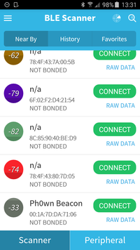
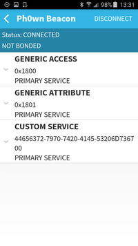
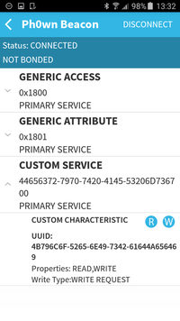
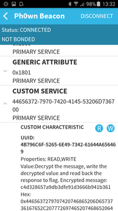
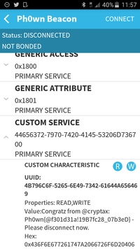

# Ph0wn CTF: Over The Air

**Category**: Network, **Points**: 250, **Solves**: 1

## Description

I spot a crocodile in the bush. Strange, its teeth were blue! It probably ate blueberries?

The crocodile seemed tired, low energy.
You might need several attempts to communicate with it. Be patient. Crocodiles do not like stress.
Also, be warned that this crocodile disconnects you automatically after 90 seconds.

If you have located what you are after, but fail to communicate repeatedly, come and see us and we'll manage to give you a time slot. We won't bite, promise.

Author: cryptax

## Write-up

**This challenge involved a hidden Bluetooth Low Energy beacon. First steps consisting in spotting the BLE beacon. **

### Step 1: Scan the network for Bluetooth Low Energy devices

The description talks about *low energy* and it is *over the air*. This is a strong hint for something using **Bluetooth Low Energy** (BLE). So, we scan the network for BLE devices.

There are numerous ways to scan for BLE devices. I will only cite 2:

1. Use an *Android* application such as [BLE Scanner](https://play.google.com/store/apps/details?id=com.macdom.ble.blescanner) of BluePixel Tech. But others exist and should work (e.g. nRF Connect, Beacon Toy)
2. Or use Linux tool `hcitool` (install bluetooth package first):

```bash
$ sudo hcitool lescan
00:1A:7D:DA:71:06 Ph0wn Beacon
25:55:84:20:73:70 (unknown)
```

We quickly notice a device named 'Ph0wn Beacon'.



### Step 2: Talking to the beacon

#### Services

Once we see the beacon, let's try to connect and list services. The way how to do this depends on what tool you use. Some Android applications are able to do. Linux also has tools for that:

```bash
$ sudo gatttool -b 00:1A:7D:DA:71:06 -I
[00:1A:7D:DA:71:06][LE]> connect
Attempting to connect to 00:1A:7D:DA:71:06
Connection successful
[00:1A:7D:DA:71:06][LE]> primary
attr handle: 0x0001, end grp handle: 0x0005 uuid: 00001800-0000-1000-8000-00805f9b34fb
attr handle: 0x0006, end grp handle: 0x0009 uuid: 00001801-0000-1000-8000-00805f9b34fb
attr handle: 0x000a, end grp handle: 0x000c uuid: 44656372-7970-7420-4145-53206d736700
```



The first UUIDs are standard services for BLE device. The third one is specific to the Ph0wn beacon.
We notice that its UUID actually is a hex string meaning:

```python
'4465637279707420414553206d7367'.decode('hex')
```

which means `Decrypt AES msg`.

#### Getting characteristics

We continue digging in that interesting service to inspect characteristics.

```bash
[00:1A:7D:DA:71:06][LE]> characteristics
handle: 0x0002, char properties: 0x02, char value handle: 0x0003, uuid: 00002a00-0000-1000-8000-00805f9b34fb
handle: 0x0004, char properties: 0x02, char value handle: 0x0005, uuid: 00002a01-0000-1000-8000-00805f9b34fb
handle: 0x0007, char properties: 0x20, char value handle: 0x0008, uuid: 00002a05-0000-1000-8000-00805f9b34fb
handle: 0x000b, char properties: 0x0a, char value handle: 0x000c, uuid: 4b796c6f-5265-6e49-7342-61644a656469
```



The characteristics which begin with `00002a...` are standard, but the last one is specific to the Ph0wn beacon.
Again, it is a hexstring `KyloRenIsBadJedi`.

```
In [2]: '4b796c6f52656e49734261644a656469'.decode('hex')
Out[2]: 'KyloRenIsBadJedi'
```

#### Reading the characteristic

Now, let's read the characteristic mentioned above. 

```bash
[00:1A:7D:DA:71:06][LE]> char-read-hnd 0x000c
Characteristic value/descriptor: 44 65 63 72 79 70 74 20 74 68 65 20 6d 65 73 73 61 67 65 2c 20 77 72 69 74 65 20 74 68 65 20 64 65 63 72 79 70 74 65 64 20 76 61 6c 75 65 20 61 6e 64 20 72 65 61 64 20 62 61 63 6b 20 74 68 65 20 72 65 73 70 6f 6e 73 65 20 74 6f 20 66 6c 61 67 2e 20 45 6e 63 72 79 70 74 65 64 20 6d 65 73 73 61 67 65 3a 20 63 34 64 33 32 38 36 35 37 61 39 64 62 33 64 66 65 39 31 64 33 36 36 36 62 39 34 31 62 33 36 31
```

The value is an ASCII string whose meaning is the following message: _Decrypt the message, write the decrypted value and read back the response to flag. Encrypted message: c4d328657a9db3dfe91d3666b941b361_:

```
response = '44 65 63 72 79 70 74 20 74 68 65 20 6d 65 73 73 61 67 65 2c 20 77 72 69 74 65 20 74 68 65 20 64 65 63 72 79 70 74 65 64 20 76 61 6c 75 65 20 61 6e 64 20 72 65 61 64 20 62 61 63 6b 20 74 68 65 20 72 65 73 70 6f 6e 73 65 20 74 6f 20 66 6c 61 67 2e 20 45 6e 63 72 79 70 74 65 64 20 6d 65 73 73 61 67 65 3a 20 63 34 64 33 32 38 36 35 37 61 39 64 62 33 64 66 65 39 31 64 33 36 36 36 62 39 34 31 62 33 36 31'

In [4]: response.replace(' ','').decode('hex')
Out[4]: 'Decrypt the message, write the decrypted value and read back the response to flag. Encrypted message: c4d328657a9db3dfe91d3666b941b361'
```



#### Putting it all together

From the UUID of the service, participants are expected to guess the ciphertext is encrypted with AES.
From the UUID of the characteristic, participants guess the key is `KyloRenIsBadJedi`

The length of the ciphertext is 16, which is AES block size, so we can try with AES ECB.


So, we need to decrypt the ciphertext:

```python
from Crypto.Cipher import AES
key = b'KyloRenIsBadJedi'
algo = AES.new(key, AES.MODE_ECB)
ciphertext = 'c4d328657a9db3dfe91d3666b941b361'
algo.decrypt(ciphertext.decode('hex'))
```

The result is `Good Padawan!!!!`.

### Step 3: Sending the response to the beacon

Remember: the beacon said  *Decrypt the message, write the decrypted value and read back the response to flag*.
So let's send Good Padawan to our beacon.

```
In [3]: 'Good Padawan!!!!'.encode('hex')
Out[3]: '476f6f64205061646177616e21212121'
```

Again, this can be done with an app, or with gatttool.

```
[00:1A:7D:DA:71:06][LE]> connect
Attempting to connect to 00:1A:7D:DA:71:06
Connection successful
[00:1A:7D:DA:71:06][LE]> char-write-req 0x000c 476f6f64205061646177616e21212121
Characteristic value was written successfully
[00:1A:7D:DA:71:06][LE]> char-read-hnd 0x000c
Characteristic value/descriptor: 43 6f 6e 67 72 61 74 7a 20 66 72 6f 6d 20 40 63 72 79 70 74 61 78 3a 20 50 68 30 77 6e 7b 40 66 33 30 31 64 33 31 61 21 31 39 42 37 66 63 32 38 5f 30 37 62 33 65 44 7d 20 2d 20 50 6c 65 61 73 65 20 64 69 73 63 6f 6e 6e 65 63 74 20 6e 6f 77 2e
```

Note:

- The beacon automatically disconnects people after 90 seconds. This hardens the challenge a bit, but also ensures that everybody gets a chance to connect...
- `char-write-cmd` does not seem to work

Now decrypt the response:

```python
response = '43 6f 6e 67 72 61 74 7a 20 66 72 6f 6d 20 40 63 72 79 70 74 61 78 3a 20 50 68 30 77 6e 7b 40 66 33 30 31 64 33 31 61 21 31 39 42 37 66 63 32 38 5f 30 37 62 33 65 44 7d 20 2d 20 50 6c 65 61 73 65 20 64 69 73 63 6f 6e 6e 65 63 74 20 6e 6f 77 2e'
response.replace(' ','').decode('hex')
```

and you get:

**Congratz from @cryptax: Ph0wn{@f301d31a!19B7fc28_07b3eD} - Please disconnect now.**

The flag is **Ph0wn{@f301d31a!19B7fc28_07b3eD}**




## Other write-ups and resources


