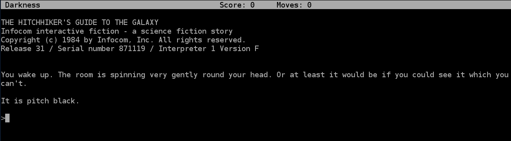

# Ph0wn CTF: Don't Panic

**Category**: Retro, **Points**: 300, **Solves**: 1

## Description

In this patched Infocom Interactive Fiction, you will wake up with a splitting headache for the worst day of your life, as the Earth is going to be demolished by a fleet of Ph0wn Constructor spaceships... However, you will have several options in order to grab the Ph0wn flag, either enjoy this classic game and/or enter the Matrix that hides behind it...

To score, please remove all spaces in the flag you find.

sha256: [DONTPANIC](./DONTPANIC)
`b3e036978cd71523b0a2a8e5592a42334eaaae202fa0471e5e5b5f586209270d`

Author: raspberry4all


## Write-up

*This is how I solved it personally, but I know that the adhoc team did it slightly differently*

### Running the game

The description talks about Infocom game. Those games can be run on a virtual machine  [Z-machine](https://en.wikipedia.org/wiki/Z-machine). Note that `file DONTPANIC` mentions SuperH but is a false positive.

Install an interpreter for the Z-machine, such as [Frotz](https://github.com/DavidGriffith/frotz): `sudo apt-get install frotz` and run the game: `frotz infocom.dat`



### Playing the game

The game is a (hacked) version of the *Hitchhiker's guide to the Galaxy*. I played the game a little, for fun, and got ran over by a bulldozer several times ;) I finally decided it was time to work out a solution for the challenge ;P and read walk through to work my way out.

Read this if you want to solve the challenge, don't read these if you want to play the game:

- [walkthrough #1](https://www.gamefaqs.com/pc/564459-the-hitchhikers-guide-to-the-galaxy-1984/faqs/1612)
- [walkthrough #2](http://www.thecomputershow.com/computershow/walkthroughs/hitchhikersguidewalk.htm)

There are 5 major steps:

1. In your house, you need to get your gown and swallow analgesic to stop your head spinning
2. When you get out of the house, you need to lie down and wait there (even when the bulldozer tries to knock the house down). Lie down until you are made to stand up.
3. Follow Ford in the pub and drink beer. Get outside with Ford when your house crashes down, then grab the device Ford drops. Push the green button.
4. In space, you need to wait and smell, hear. You will finally see Ford giving you peanuts. Then, when you activate the machine's switch it will tell you have to listen to captain's poetry and memorize a given word of a given verse. The exact word and verse change each time you play.
5. When you get back to your room, type the given word on the keyboard of the room.


```
>type "thou" on keyboard
The glass case opens. Also, the Matrix of the Universe is revealed to you for a fraction of a second. You see the Z-machine that runs it
all, including an hexdump of a Ph0wn flag:       0a85 187b 07c1 28ac 1545 987d
```

You don't need to continue the game passed that point.

### Decoding the flag

The hexdump `0a85 187b 07c1 28ac 1545 987d` is Z-Machine text that we need to decode. We use the [specs](http://inform-fiction.org/zmachine/standards/z1point1/index.html) for that.


In Z-Machine, text is made of 2-byte words, so:
- 0a 85
- 18 7b
- 07 c1
- 28 ac
- 15 45
- 98 7d

Each word is divided into three 5-bit 'Z-characters', plus 1 bit left over which marks the end if it is set:

- 0 00010 10100 00101: 0x02 0x14 0x05
- 0 00110 00011 11011: 0x06 0x03 0x1b
- 0 00001 11110 00001 0x01 0x1e 0x01
- 0 01010 00101 01100: 0x0a 0x05 0x0c
- 0 00101 01010 00101: 0x05 0x0a 0x05
- 1 00110 00011 11101: 0x06 0x03 0x1d

So, we have the following flow of Z-characters:
`0x02 0x14 0x05 0x06 0x03 0x1b 0x01 0x1e 0x01 0x0a 0x05 0x0c 0x05 0x0a 0x05 0x06 0x03 0x1d`
Let's begin. `0x02.`

The specs say : *"In Versions 3 and later, Z-characters 1, 2 and 3 represent abbreviations"*.

We download [ztools](http://inform-fiction.org/zmachine/ztools.html) and compile: `make`. The `infodump` tool tells us `DONTPANIC` is **version 5**:

```bash
$ ./infodump ./distribute/DONTPANIC

Story file is ./distribute/DONTPANIC

    **** Story file header ****

Z-code version:           5
```

So the first 0x02 means we are using an **abbreviation** (nice concept!).

Read forward the specs: *" the next Z-character indicates which abbreviation string to print. If z is the first Z-character (1, 2 or 3) and x the subsequent one, then the interpreter must look up entry 32(z-1)+x in the abbreviations table and print the string at that word address."*

So, we have `z=2` and `x=0x14`. Meaning we will need to look up for `abbrev[32(2-1)+20]=abbrev[52]`

We lookup the abbreviation table using `./infodump -a ../infocom.dat`:

```
Story file is ../infocom.dat

    **** Abbreviations ****

[ 0] "the "
[ 1] "you "
[ 2] ", "
[ 3] "You "
...
[51] "nothing "
[52] "Ph0wn "
```

So, the first word is `Ph0wn `.

Now, we have **0x05**.
The specs say : "Z-characters 4 and 5 permanently change alphabet, according to the same table, and are called 'shift lock' characters. "
We were using alphabet A0, we will now use alphabet A2 (punctuation).

Then, we have **0x06**.
The specs say: "Z-character 6 from A2 means that the two subsequent Z-characters specify a ten-bit ZSCII character code: the next Z-character gives the top 5 bits and the one after the bottom 5. "

So, we must now read **0x03 0x1b**.
Top 5 bits: `00011`
Bottom 5 bits: `11011`
10-bit ZSCII character: `00 0111 1011` -> 7b

See [3.8.3](http://inform-fiction.org/zmachine/standards/z1point1/sect03.html) 0x7b is `{`.

Then, we have `0x01`: another abbreviation.
`abbrev[32(1-1)+0x1e]=abbrev[30]="Improbability "`

Then, `0x01 0x0a`: `abbrev[32(1-1)+10]="of "`

Then, we have `0x05` so we are going to change alphabet again.

See [3.2.3](http://inform-fiction.org/zmachine/standards/z1point1/sect03.html), which says : *"In Versions 3 and later, the current alphabet is always A0 unless changed for 1 character only: Z-characters 4 and 5 are shift characters. Thus 4 means "the next character is in A1" and 5 means "the next is in A2". There are no shift lock characters. "* So, 0x05 means the next character is in **A2**.

We now read **0x0c**. In A2, this is : 4

Then, again `0x05`. So, we are again in A2. And next character is **0x0a**, which is 2

Then, again `0x05`: we go back to A2. Followed by A6 and **0x03 0x1d**
10-bit ZSCII character is 7d, which is `}`.

So, the flag is `Ph0wn {Improbability of 42}`.
To enter the flag, we'll ask to remove all spaces: `Ph0wn{Improbabilityof42}`.


## Other write-ups and resources

- [To play games using frotz](https://github.com/DavidGriffith/frotz/blob/master/HOW_TO_PLAY)
- [Step by step explanations on Z-characters and Z-strings](https://rjbs.manxome.org/rubric/entry/2014) - though not totally clear to me ;-)
