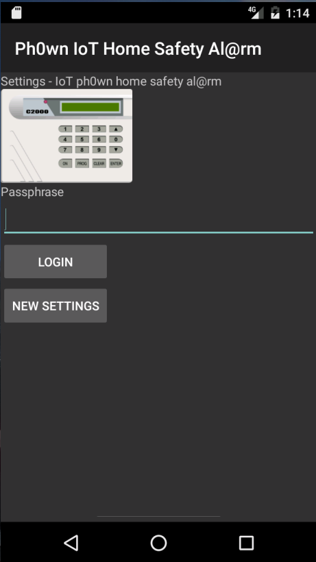

# Ph0wn CTF: Home Alarm

**Category**: Reverse, **Points**: 250, **Solves**: 1

## Description

My friend has lent me his house for some vacations on the sunny French riviera while he's traveling elsewhere. His house is protected with a home safety alarm which can be controlled using an Android app.

He sent me the Android application and the credentials file to be inserted in the application's private data storage. Depending on your system, this should be in  `/data/data/ph0wn/ctf/alarm/files/settings.dat` or in `/data/data/ph0wn.ctf.alarm/files/settings.dat

Damn! How silly! He forgot to give me the alarm phone number and secret code or the passphrase to unlock the credentials!

Am I sleeping under the stars tonight? Please stop the alarm, retrieve the alarm's phone number and secret code ... and the flag.


SHA256:
```
2a2305f3e9eaf82ec1d84edae93b0b600b7d3a4359d3e97a1a131205d7ffc772  settings.dat
0b1b2c1773bb8a9592741dbce61d296d236705179a872fe769f303d19b9510de  alarm.apk
```

**Nota**. The flag to enter has the usual format `Ph0wn{...}`

Author: cryptax

### Hint

During the CTF, the following hint was given to players: `SMALI`

## Write-up

### Spotting sherlock()

Inspect the Android application `alarm.apk`.

With Androguard, we spot a strange method `sherlock()` in class `b`: the name is strange, the method does not seem to be used, the contents look clean:

```
a,d,dx = AnalyzeAPK('alarm.apk', decompiler='dad')
d.CLASS_Lph0wn_ctf_alarm_b.METHOD_sherlock.source()

    int sherlock(int p2)
    {
        int v0;
        switch (p2) {
            case 0:
                v0 = 1;
                break;
            case 1:
                v0 = 2;
                break;
            default:
                v0 = 3;
        }
        return v0;
    }
```

We don't see more with other decompilers (`dex2jar` + `jd-gui`, IDA Pro, JEB).

### Spotting hidden smali code

However, if we look at the **smali** code, we see decompilers are missing lots of stuff in this method:

```
d.CLASS_Lph0wn_ctf_alarm_b.METHOD_sherlock.pretty_show()
sherlock-BB@0xe : 
	5  (0000000e) const/16            v2, 16
	6  (00000012) new-array           v1, v2, [B
	7  (00000016) fill-array-data     v1, 17
	8  (0000001c) const/4             v0, 0 [ sherlock-BB@0x1e ]

sherlock-BB@0x1e : 
	9  (0000001e) array-length        v2, v1
	10 (00000020) if-ge               v0, v2, -12 [ sherlock-BB@0x24 sherlock-BB@0x8 ]

sherlock-BB@0x24 : 
	11 (00000024) aget-byte           v2, v1, v0
	12 (00000028) xor-int/lit8        v2, v2, 33
	13 (0000002c) int-to-byte         v2, v2
	14 (0000002e) aput-byte           v2, v1, v0
	15 (00000032) add-int/lit8        v0, v0, 1
	16 (00000036) goto                -12 [ sherlock-BB@0x1e ]

sherlock-BB@0x38 : 
	17 (00000038) fill-array-data-payload'oNcTSFM@SR`UiNLD' [ sherlock-BB@0x50 ]

```

Let's look into that code step by step.

```
sherlock-BB@0xe : 
	5  (0000000e) const/16            v2, 16
	6  (00000012) new-array           v1, v2, [B
	7  (00000016) fill-array-data     v1, 17
	8  (0000001c) const/4             v0, 0 [ sherlock-BB@0x1e ]
```

This creates an array of 16 bytes (lines 5 and 6).
Then, this array is populated with hard-coded values `oNcTSF...` (etc).
Finally, we initialize an index to 0.

Next:

```
sherlock-BB@0x1e : 
	9  (0000001e) array-length        v2, v1
	10 (00000020) if-ge               v0, v2, -12 [ sherlock-BB@0x24 sherlock-BB@0x8 ]
```

This sets v2 to the length of the array held in v1. That's 16.
The second line tests if the index v0 is smaller than 16.
If so, we'll jump to some earlier smali code.
Basically, this is a loop test on all elements of the byte array.

Then, we have the loop itself:

```
sherlock-BB@0x24 : 
	11 (00000024) aget-byte           v2, v1, v0
	12 (00000028) xor-int/lit8        v2, v2, 33
	13 (0000002c) int-to-byte         v2, v2
	14 (0000002e) aput-byte           v2, v1, v0
	15 (00000032) add-int/lit8        v0, v0, 1
	16 (00000036) goto                -12 [ sherlock-BB@0x1e ]
```

First, we get the byte of the array at index v0 and store that in v2. In pseudo C, that would be `v2 = v1[v0]`.
Then we XOR that value with 33 (0x21).
Then, as XOR operates on integers, we convert the result back to an int.
Then, we store the result in v1[v0].
Then, we increment the index.
Then, we loop.

So, basically, we are XORing the array with 0x21.
Let's try this.

```python
encrypted = 'oNcTSFM@SR`UiNLD'
''.join([chr(ord(x) ^ 33) for x in list(encrypted)])
```

We get the result: `NoBurglarsAtHome`.
This can't be a coincidence.

### Run the app

We install the application on an Android emulator: `adb install alarm.apk`.
Then we push `settings.dat` at the right place: `adb push settings.dat /data/data/ph0wn.ctf.alarm/files/settings.dat`

We launch the application on the emulator. It asks for a passphrase.
Let's enter `NoBurglarsAtHome`.
It works! It accepts it! **That's good**.



We can stop the alarm for instance by pressing the button "STOP ALARM".
If you are in call mode, you'll notice this call a given phone number, followed by some code starting by `Ph0wn`.


If you are unlucky, you won't get the character chain but the dial number which corresponds: P is 7, h is 4 etc.


Anyway, you already know the **phone number** of the alarm.

If you fire `adb logcat` to view the system logs, you'll notice:

```
7-18 13:48:42.202   252   252 I Telecom : CallAudioManager: updateAudioStreamAndMode :  mIsRinging: false, mIsTonePlaying: false, call: [247743141, CONNECTING, null, tel:**********,Ph*wn{MeWantCookiesShareThemMaybe}*, A, childs(0), has_parent(false), [[Capabilities:]]]
```

You have something which is very close to the flag in the logs: `Ph*wn{MeWantCookiesShareThemMaybe}`. For some strange reason, the logs aren't displaying totally correct.

#### Alternative 1: guess

Either from here you guess the flag is `Ph0wn{MeWantCookiesShareThemMaybe}` which shouldn't be very difficult because all flags start with Ph0wn.

#### Alternative 2: inspect SMS mode

Run `adb logcat -b radio`

In the application, select the SMS mode and hit a command button such as "STOP ALARM".

Spot this in the logs:

```
07-18 13:52:06.893    67    95 D AT      : AT> 0001000a814001020304000033d0e0745ad441d1b0bb7b836a96af61377df87eafd3e5f9141d9697a9e872bb19ce8bcb9b1488589c06a5cda214
```

This is the contents of the SMS being sent. [Decode it online](https://www.diafaan.com/sms-tutorials/gsm-modem-tutorial/online-sms-pdu-decoder/):

```
To: 	0410203040
Message:  PASSE:Ph0wn{MeWantCookiesShareThemMaybe} DESARMER
```

So the flag is `Ph0wn{MeWantCookiesShareThemMaybe}`

### Alternative 3: Decrypt the Settings

This is probably the hardest way ;)
By reverse engineering the android application, you'll understand the settings are formatted as such:

```
0x00 Salt Length (1 byte) Salt (several bytes)
0x01 IV length (1 byte) IV (several bytes)
0x02 1 byte where iterations = that byte x 1000
0x03 Ciphertext length (1 byte) Ciphertext (several bytes)
```

The ciphertext is encrypted with AES CBC PKCS5 padding. And the key is derived from PBKDF2WithHmacSHA1 and the given salt and iterations.

Knowing this and the initial passphrase is `NoBurglarsAtHome`, you can write a standalone program to decrypt the `settings.dat`.
See `DecryptSettings.java`

```bash
$ java DecryptSettings
...
  Plaintext=0410203040:Ph0wn{MeWantCookiesShareThemMaybe}
```


## Other write-ups and resources

[PasteBin](https://pastebin.com/zGLmRv2f) by Maro
